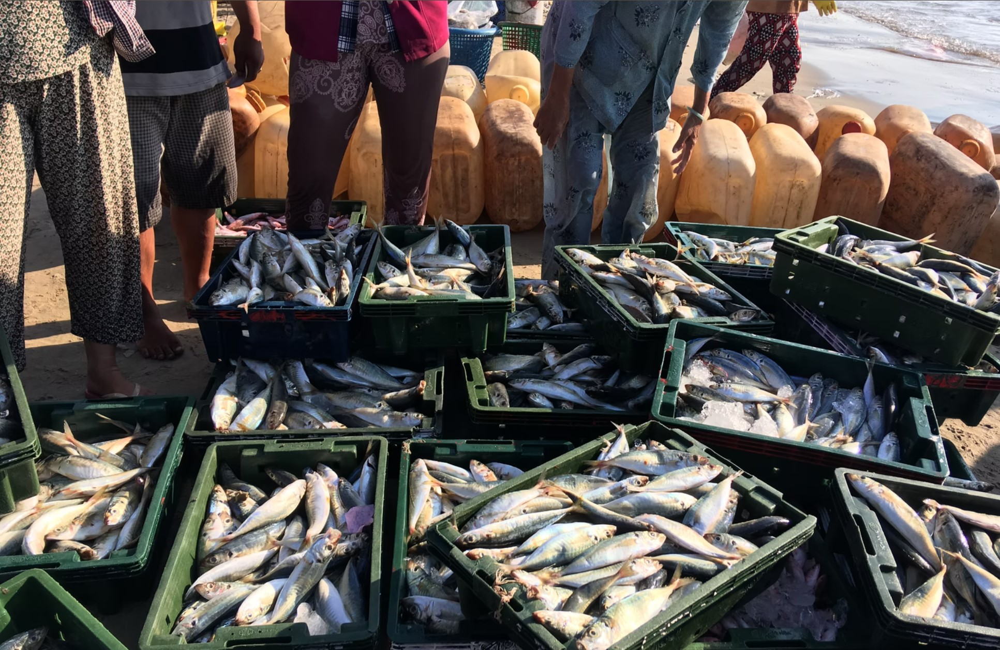
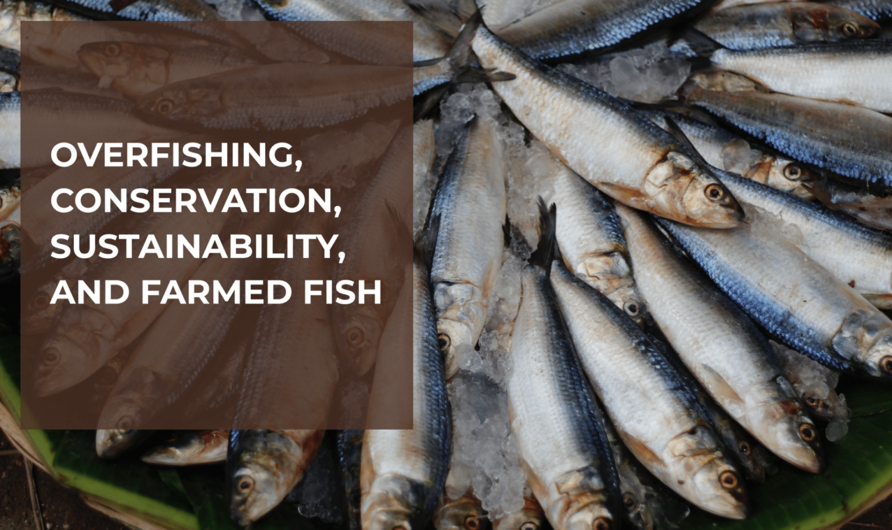

Exploring Global Seafood Production: Capture Fisheries Vs Aquaculture Farming
---
title: "Global Seafood Production: Capture Fisheries Vs Aquaculture Farming"
author: "Huma Ali Meer"
date: "12/8/2021"
output: 
  powerpoint_presentation:
    reference_doc: style_template.pptx
    slide_level: 2
---

# Overview of the Data and Domain of Research

## Dataset: Global Seafood Production

::: {.columns}
::: {.column}
### [Tidy Tuesday Week 42 2021](https://github.com/rfordatascience/tidytuesday/blob/master/data/2021/2021-10-12/readme.md)

These data are a collection of datasets on global seafood production and consumption from OurWorldinData.org.

According to theOurWorldinData.org website, Aquaculture refers to the practice of fish and seafood farming.

The distinction between farmed fish and wild catch is similar to the difference between raising livestock rather than hunting wild animals.
:::

::: {.column}

:::
:::

::: {.columns}
::: {.column}
## Questions

1.  How has the global capture fisheries production and global aquaculture production performed, relative to each other?

2.  What has been the trend for fish stocks that are farmed unsustainably versus fish stocks that were farmed sustainably over the years of 1974-2017?

3.  Which countries produce the most seafood using Aquaculture?
:::

::: {.column}


:::
:::

# Load packages and data

## Setup

```{r setup}
rm(list = ls())

knitr::opts_chunk$set(
  echo = TRUE, message = FALSE,
  warning = FALSE, include = TRUE,
  fig.showtext = TRUE,
  dpi = 300
)
```

```{r load}
library(tidyverse)
library(ggplot2)
library(showtext)
```

## Loading data

-   aqua_prod \<- aquaculture-farmed-fish-production.csv
-   aqua_vs_cap_prod \<- capture-fisheries-vs-aquaculture.csv
-   cap_prod \<- capture-fishery-production.csv
-   fish_stock_sustainable \<- fish-stocks-within-sustainable-levels.csv

```{r, include = FALSE}
aqua_prod <- readr::read_csv("https://raw.githubusercontent.com/rfordatascience/tidytuesday/master/data/2021/2021-10-12/aquaculture-farmed-fish-production.csv")

aqua_vs_cap_prod <- readr::read_csv("https://raw.githubusercontent.com/rfordatascience/tidytuesday/master/data/2021/2021-10-12/capture-fisheries-vs-aquaculture.csv")

cap_prod <- readr::read_csv("https://raw.githubusercontent.com/rfordatascience/tidytuesday/master/data/2021/2021-10-12/capture-fishery-production.csv")

fish_stock_sustainable <- readr::read_csv("https://raw.githubusercontent.com/rfordatascience/tidytuesday/master/data/2021/2021-10-12/fish-stocks-within-sustainable-levels.csv")
```


# Global Wild Catch of Seafood vs Global Farming of Seafood

## Prepare data

```{r prep_world_aqua_vs_cap}
aqua_vs_cap_prod_dat <- aqua_vs_cap_prod |>
  rename(
    AquaProd = `Aquaculture production (metric tons)`,
    CapProd = `Capture fisheries production (metric tons)`
  ) |>
  filter(Entity == "World")
```

## Build Base Plot

::: {.columns}
::: {.column}
```{r plot1}
p <- aqua_vs_cap_prod_dat |>
  ggplot(aes(x = Year)) +
  geom_line(aes(y = AquaProd)) +
  geom_line(aes(y = CapProd)) +
  geom_ribbon(aes(
    ymin = pmin(AquaProd, CapProd),
    ymax = CapProd
  ),
  fill = "tomato", alpha = 0.5
  ) +
  geom_ribbon(aes(
    ymin = pmin(AquaProd, CapProd),
    ymax = AquaProd
  ),
  fill = "steelblue", alpha = 0.5
  ) +
  scale_y_continuous(labels = scales::comma) +
  annotate(geom = "text", x = 2005, y = 15000000, label = "Farmed seafood") +
  annotate(geom = "text", x = 1970, y = 85000000, label = "Wild-caught seafood")
```
:::

::: {.column}
```{r, echo = FALSE}
plot(p)
```
:::
:::

## Add theme and labels

::: {.columns}
::: {.column}
```{r}
p <- p +
  labs(
    subtitle = "Global wild catch of seafood vs global farming of seafood",
    y = "Metric Tonnes"
  ) +
  theme(
    panel.grid.major.x = element_blank(),
    panel.grid.major.y = element_blank(),
  )
```
:::

::: {.column}
```{r, echo = FALSE}
plot(p)
```
:::
:::

## Update theme

```{r}
bg <- "#29335C"
line_palette <- c("#E4572E", "#F3A712")
text_color <- "#FFFFFC"

theme_fish <- theme_classic() +
  theme(
    axis.title.x = element_blank(),
    panel.background = element_rect(fill = bg, color = NA),
    plot.background = element_rect(fill = bg, color = NA),
    text = element_text(color = text_color),
    axis.text = element_text(color = text_color),
    legend.position = "None",
    axis.line = element_line(color = text_color)
  )
```

## Build line plot, update units and labels

```{r}
CvsA <- aqua_vs_cap_prod_dat |>
  pivot_longer(cols = c(-Year, -Code, -Entity), names_to = "production_type", values_to = "total_tons") |>
  mutate(millions_of_tons = as.numeric(total_tons) / 1000000) |>
  ggplot(aes(x = Year, y = millions_of_tons, group = production_type, color = production_type)) +
  geom_line(size = 1.2) +
  scale_color_manual(values = line_palette) +
  annotate(geom = "text", x = 2010, y = 35, label = "Farmed seafood", color = line_palette[1]) +
  annotate(geom = "text", x = 1970, y = 80, label = "Wild-caught seafood", color = line_palette[2]) +
  labs(y = "Millions of metric tons") +
  theme_fish
```

## Global wild catch of seafood vs global farming of seafood

::: {.columns}
::: {.column}
-   Up until 2012, global seafood production was predominantly done through captured fisheries.
-   Aquaculture production only produced a small proportion of the global seafood production.
-   From 2012 onwards, aquaculture production took over captured fisheries production and has continued to grow.
-   From 1960 until 2015 fish farming has increased 50-fold to over 100 million per year.
:::

::: {.column}
```{r, echo=FALSE}
CvsA
```
:::
:::

# Proportion of Global Sustainable Vs. Unsustainable fish farming

## EDA

::: {.columns}
::: {.column}
For our second plot, we are interested in exploring the trend for fish stocks that are farmed unsustainably versus fish stocks that were farmed sustainably over the years of 1974-2017.
:::

::: {.column}
```{r, results='hide'}
glimpse(fish_stock_sustainable)

head(fish_stock_sustainable)

arrange(fish_stock_sustainable, Year)

fish_stock_sustainable <- rename(fish_stock_sustainable,
  Overexploited = `Share of fish stocks that are overexploited`,
  Sustainable = `Share of fish stocks within biologically sustainable levels (FAO, 2020)`
)
```
:::
:::

## Plot

```{r, results='hide'}
p <- fish_stock_sustainable |>
  filter(Entity == "World") |>
  select(Year, Overexploited, Sustainable) |>
  gather(key = "proportion", value = "Proportion", -Year) |>
  ggplot(aes(x = Year, y = Proportion)) +
  geom_line(aes(color = proportion, linetype = proportion)) +
  scale_color_manual(values = c("darkred", "steelblue")) +
  labs(y = "Overexploited vs. Sustainable Production %") +
  theme(
    legend.position = "bottom",
    panel.grid.minor.x = element_blank(),
    panel.grid.minor.y = element_blank()
  )
```

## Sustainable stocks

::: {.columns}
::: {.column}
-   The graph shows that, over time, the global share of fish stocks that are over-exploited has increased and the global share of fish-stocks that are sustainably farmed has decreased.
-   **This is a cause for global concern.**
-   As seen in the 'Farmed Seafood Vs. Wild-Caught Seafood' graphs earlier, the increase in aquaculture production has helped to diffuse this pressure on global fish stocks due to overexploitation (OurWorldinData.org).
:::

::: {.column}
```{r, echo = FALSE}
p
```
:::
:::

# Which countries produce the most seafood using Aquaculture?

## Prep Data

```{r}
avg_aqua_prod_2010s <- aqua_prod |>
  filter(
    !is.na(`Aquaculture production (metric tons)`),
    !is.na(Code),
    Year >= 2010
  ) |>
  group_by(Entity) |>
  summarise(avg_aqua_prod = mean(`Aquaculture production (metric tons)`, na.rm = TRUE)) |>
  rename(region = Entity)
```

## Plot Map

```{r}
map <- map_data("world") |>
  left_join(avg_aqua_prod_2010s) |>
  filter(region != "Antarctica") |>
  ggplot(aes(x = long, y = lat, group = group, fill = avg_aqua_prod)) +
  geom_polygon(color = "black", size = 0.01) +
  scale_fill_viridis_c(
    trans = "log", option = "C",
    breaks = c(0, 1, 100, 10000, 1000000),
    labels = scales::comma
  ) +
  labs(
    fill = "Metric tons",
    caption = "Grey = no data",
    subtitle = "Most of the worlds growth in aquaculture production has come from East Asia and the Pacific.
China produced 61 million tonnes in 2015, highest level of production in the world."
  ) +
  theme_void() +
  theme(
    plot.background = element_rect(color = "#B9D6F2", fill = "#B9D6F2"),
    plot.title = element_text(hjust = 0.5)
  )
```

## Average Yearly Aquaculture Production 2010-2018

```{r, echo = FALSE, fig.height=4, fig.width = 8}
plot(map)
```

------------------------------------------------------------------------
## Summary

1.    Aquaculture production has dominated captured fisheries production.

2.    Global unsustainable farming has increased and sustainable farming has decreased.

3.    Aquaculture production has helped release the pressure on global fish-stocks.

4.    Most of the world’s growth in aquaculture production has come from East Asia and the Pacific.


##
Image by Clker-Free-Vector-Images from Pixabay    
Image by yourbassguy.com
